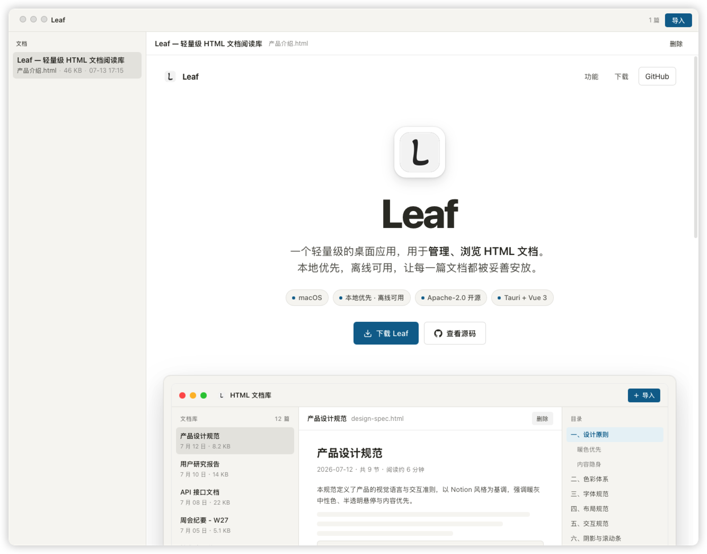

<div align="center">

  

# Leaf

AI 生成了太多 HTML 报告，但你找不到一个顺手的管理工具。**Leaf** 是一个轻量级的桌面应用，专为集中管理、安全浏览 HTML 文档而生。

[](LICENSE)
[](#平台支持)



</div>

## 功能特性

- **本地文档库** — 导入 AI 生成的 HTML 报告或资料，自动复制到统一的本地库目录管理
- **自动元数据** — 导入时自动提取标题与摘要，告别未命名文档
- **沙箱渲染** — 通过沙箱 iframe 安全渲染任意 HTML 文档，不用担心恶意代码
- **目录提取** — 自动从文档中提取目录，快速跳转，长报告也不怕
- **本地索引** — 基于 SQLite 索引，启动即用，离线可用，数据完全在本地


## 下载安装

### 1. 下载
前往 [Releases 页面](https://github.com/pf711-dev/leaf/releases)，下载 `Leaf_x.x.x_aarch64.dmg`（适用于 Apple Silicon Mac）。

### 2. 安装
双击打开 DMG 文件，将 Leaf 拖入 `Applications` 文件夹。

### 3. 首次打开
双击 Leaf 图标，系统可能会提示「Leaf 已损坏，无法打开」—— 这是 macOS 对未公证应用的安全限制，**不是应用本身的问题**。

请任选一种方式通过：

- **方式一（推荐）**：打开 `系统设置` → `隐私与安全性`，滚动到底部，找到 Leaf 的提示，点击 **「仍要打开」**。
- **方式二（终端）**：打开终端，粘贴运行以下命令后重试：
  ```bash
  xattr -dr com.apple.quarantine /Applications/Leaf.app

## 贡献

欢迎提交 Issue 反馈问题或建议新功能，也欢迎通过 Pull Request 贡献代码。

## 许可证

本项目基于 [Apache License 2.0](LICENSE) 开源，Copyright 2026 pf711-dev.
