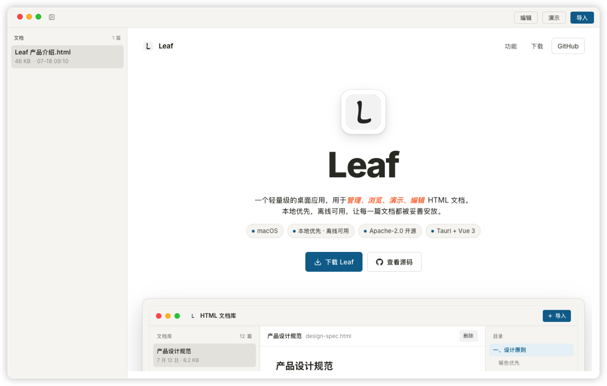

<div align="center">

  

# Leaf

**Leaf** 是一个轻量级的桌面应用，以本地文件夹为仓库，管理、浏览、编辑、演示 HTML 文档。

[](LICENSE)
[](#下载安装)



</div>

## 功能特性

- **仓库模式**：打开本地文件夹作为仓库，自动索引所有 HTML 文件，无需手动导入
- **实时同步**：文件增删改即时反映，编辑保存直接覆盖原文件
- **自动元数据**：自动提取标题与摘要，告别未命名文档
- **沙箱渲染**：通过沙箱 iframe 安全渲染任意 HTML 文档
- **目录提取**：自动从文档中提取目录，快速跳转
- **文件夹管理**：侧边栏目录树，支持新建/重命名/删除文件夹（最多 3 级）
- **演示模式**：沉浸式全屏演示
- **编辑模式**：可直接编辑 HTML 内容并保存回原文件


## 下载安装

前往 [Releases 页面](https://github.com/pf711-dev/leaf/releases)，根据你的系统选择对应的安装包。

| 文件 | 平台 | 说明 |
|------|------|------|
| `Leaf_x.x.x_aarch64.dmg` | Apple Silicon（M1 ~ M4） | macOS 标准安装包 |
| `Leaf_x.x.x_x64.dmg` | Intel Mac | macOS 标准安装包 |
| `Leaf_x.x.x_x64_en-US.msi` | Windows 10 / 11 | Windows 安装包 |

### macOS 安装

双击 `.dmg` 文件，将 Leaf 拖入 `Applications` 文件夹。

首次打开若提示「Leaf 已损坏，无法打开」，这是 macOS 对未公证应用的安全限制，**不是应用本身的问题**。请任选一种方式解决：

- **方式一（推荐）**：打开 `系统设置` → `隐私与安全性`，滚动到底部，找到 Leaf 的提示，点击 **「仍要打开」**。
- **方式二（终端）**：打开终端运行：
  ```bash
  xattr -dr com.apple.quarantine /Applications/Leaf.app
  ```

### Windows 安装

双击 `.msi` 文件安装。若 SmartScreen 弹出安全提示，点击 **「更多信息」→「仍要运行」** 即可。

## 贡献

欢迎提交 Issue 反馈问题或建议新功能，也欢迎通过 Pull Request 贡献代码。

## 许可证

本项目基于 [Apache License 2.0](LICENSE) 开源，Copyright 2026 pf711-dev.
